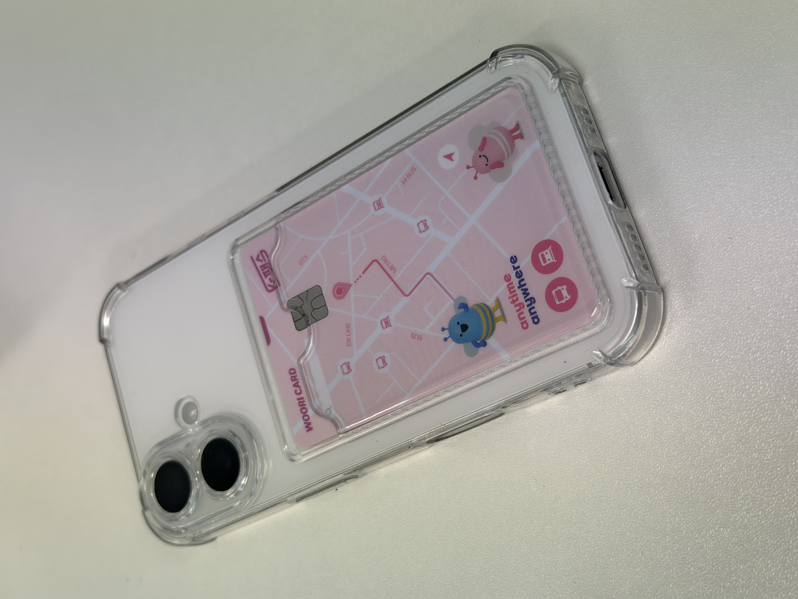

<div align="center">


# 🪖 텅장 훈련소 (Tungjang Instructor)

[](https://www.python.org/)
[](https://streamlit.io/)
[](https://www.mysql.com/)
[](https://openai.com/)

<br>

<details>
<summary><b>🎬 프롤로그: 어느 예비 훈련생의 입소 계기 (클릭하여 펼치기)</b></summary>
<div markdown="1">

<br>


"나는... 멋진 커리어와 재력을 겸비한 **사회초년생**이 되고 싶었다..."
<br>

<br>
하지만 현실은... 돈이 없어. 💸

<br>

그러던 어느 날, 옆 자리 동료가 최신형 스마트폰을 꺼내 들었다. ✨

<br>


<br>
<br>

"헐, 부럽다... 나도 폰 바꾸고 싶은데..." (내 폰을 바라보며) 📱🔨

<br>


<br>
<br>

설레는 마음으로 검색해본 그 폰의 가격은... **1,200,000원** 😱

그리고 처참한 내 수중 잔고... **100,000원** 🥶
<br>
"아... 진짜 돈이 필요한데... 내 잔고를 구원할 방법이 없을까?"

<br>

절망하던 순간, 모니터 구석에서 무언가를 발견했다.

### **[ 🪖 텅장을 구원하고픈 자, 이곳으로 오라! ]**

<br>

"여기라면..! 내 텅장을 구할 수 있을지도 몰라!"

지푸라기라도 잡는 심정으로 입소 신청 버튼을 눌렀고...
<br>
**마침내, 악명 높은 교관을 마주하게 되는데...**

</div>
</details>

<br>

> **"본인의 소비에 있어서는 한없이 관대한 우리들,**<br>
> **무엇이 낭비인지 모르고 빠져나가는 수많은 돈들..."**

<br>

### **"말뿐인 다짐은 의미 없다. 숫자로 증명해라."**
\- 텅장 훈련소 교관 -

<br>

**텅장 훈련소**는 당신의 텅텅 비어가는 통장을 막기 위해,<br>
**교관**의 엄격한 지휘 아래 소비 습관을 교정하고 훈련하는 **자산 관리 훈련 프로그램**입니다.

링크: https://tungjang-instructor.streamlit.app/

<br>

</div>

---

## 🎯 프로젝트 목적 (Mission)

자신의 소비 패턴을 객관적으로 직시하지 못하는 훈련병들을 위해 **교관**이 직접 나섰습니다.
단순히 가계부를 작성하는 것을 넘어, **소비의 성격을 재해석**하고 **미래를 시뮬레이션**하여 강인한 경제 습관을 기르는 것이 본 훈련소의 목표입니다.

### 🔥 핵심 철학: 소비의 4가지 본질 (The 4 Personas)
**"돈을 어디에 썼는가보다, '어떤 마음'으로 썼는가가 중요하다."**
<br>
텅장 훈련소는 모든 소비 데이터를 분석하여 아래 **4가지 페르소나**로 재정의합니다. 훈련생은 이 지표를 통해 자신의 정신 상태를 점검받게 됩니다.

| 아이콘 | 유형 | 정의 | 예시 | 판정 |
| :---: | :--- | :--- | :--- | :---: |
| 🔴 | **게으름 (Laziness)** | 귀찮음과 편리함에 굴복하여 발생한 비용 | 택시, 연체료 | **낭비** |
| 🟠 | **충동 (Impulse)** | 계획 없이 순간의 감정에 휘둘린 지출 | 배달음식, 술 | **낭비** |
| 🔵 | **호흡 (Breathing)** | 생존과 생활 유지를 위해 반드시 필요한 비용 | 월세, 통신비, 식재료, 생필품 | **필수** |
| 🟢 | **성장 (Growth)** | 더 나은 미래의 나를 위한 투자 | 도서, 운동, 강의, 저축/투자 | **투자** |

---

## 📂 주요 훈련 과정 (Features)

### 1. 메인 훈련장 (Main Training Center)
훈련의 시작점입니다. 이번 달 목표 예산을 설정하고, 실시간으로 교관의 피드백을 받습니다.

* **💰 예산 설정**: 사이드바를 통해 월간 목표 예산을 설정합니다.
* **📢 교관의 감정 상태**: 예산 소진율에 따라 교관의 표정과 메시지가 실시간으로 변화합니다.

| 예산 소진율 | 상태 | 교관의 표정 | 교관의 한마디 |
| :---: | :---: | :---: | :--- |
| **미설정** | **궁금** |  | "훈련생! 이번 달 예산을 설정하지 않았군.<br>좌측 사이드바에 입력하게!" |
| **0 ~ 30%** | **온화** |  | "예산의 30% 이하만 사용했군.<br>아주 훌륭해! 이 페이스를 유지하게. 😊" |
| **30 ~ 60%** | **걱정** |  | "벌써 예산의 절반 이상을 썼다.<br>적당히 돈을 써야 된다! 😟" |
| **60 ~ 100%** | **짜증** |  | "비상! 예산이 거의 바닥났다!<br>이제부터는 숨만 쉬고 살아라! 😠" |
| **100% 초과** | **화남** |  | "예산 초과다!!<br>훈련생, 자네는 계획이란 게 없나?! 😡" |

* **📊 전황 분석 (Key Metrics)**: 훈련생의 현재 자산 상태를 적나라하게 보여주는 핵심 지표입니다.
    * **이번 달 전체 소비**: 현재까지 사용한 총 지출 금액 (누적 전투 비용)
    * **이번 달 낭비 소비**: 교관이 '낭비(게으름+충동)'로 규정한 항목의 총합 (전력 누수)
    * **훈련생의 낭비율**: 전체 소비 중 낭비 소비가 차지하는 비율 (%)
    * **예산 소진율**: 설정한 예산 대비 현재 사용량. 100% 초과 시 즉시 경고 조치.
    * **예산 잠식률**: 낭비한 금액이 전체 예산을 얼마나 갉아먹었는지 보여주는 비율.

<br>

### 2. 소비 기록 (Spending Record)
훈련의 기본은 철저한 기록입니다. 모든 지출은 정해진 **분류 체계**에 따라 재해석되며, 데이터베이스에 즉시 반영됩니다.

* **📝 소비 기록 (Input & Edit)**: 사이드바를 통해 날짜, 시간, 금액, 메모를 입력하여 DB에 즉시 보고합니다. 입력된 데이터는 **수정(✏️) 및 삭제(🗑️)**가 가능하여 오기입에 유연하게 대처할 수 있습니다.
* **📊 월별 소비 확인 (Dashboard)**:
    * **핵심 지표**: 월 총 소비액, 소비 일수, 일평균 소비액을 상단 메트릭 카드로 즉시 파악합니다.
    * **월간 캘린더**: `Streamlit Calendar`를 활용해 월별/일별 지출 흐름을 시각적으로 확인하고, 월 이동 버튼으로 과거 데이터를 조회합니다.
    * **소비내역 상세 확인**: 캘린더 날짜 클릭 시, 해당 일자의 상세 내역(시간, 내용, 금액)을 하단 리스트와 테이블로 열람합니다.

##### **[ 자금 분류 체계 (Category System) ]**
시스템은 코드에 정의된 아래의 **대분류-중분류 체계**를 따릅니다.

| 대분류 | 중분류 (상세 항목) |
| :--- | :--- |
| **🍚 식비** | 식자재/장보기, 외식, 배달/야식, 카페/간식, 술/유흥 |
| **🏠 주거/통신** | 월세/관리비, 공과금, 통신비, 구독/OTT |
| **🛒 생활/쇼핑** | 생활용품, 패션/미용, 가전/가구, 반려동물 |
| **🚌 교통/차량** | 대중교통, 택시/호출, 자차/주유 |
| **💊 건강/운동** | 병원/약국, 운동/헬스 |
| **📚 교육/계발** | 도서/문구, 강의/수강 |
| **🤝 관계** | 경조사/선물, 데이트/모임 |
| **🎬 문화/취미** | 영화/공연, 여행 |
| **💸 금융** | 보험/세금, 저축/투자 |

<br>

### 3. 지금까지의 나 (Past Analysis)
**"과거의 나약했던 소비 습관을 심층 분석하여 뜯어고친다!"**

과거의 카드 데이터를 로드하여 단순한 금액 합산이 아닌, 행동 심리학적 관점에서 소비를 재해석하고 교정 솔루션을 제공하는 페이지입니다.

#### 1. 🔄 지출 재해석 (Reinterpretation Logic)
일반적인 카테고리(식비, 교통 등)를 소비 심리에 기반하여 **4가지 행동 유형**으로 재분류합니다.
- **🔴 낭비 :**
  - `충동`: 계획 없이 순간의 감정에 휘둘린 지출
  - `게으름`: 귀찮음과 편리함에 굴복하여 발생한 비용
- **🔵 필수 :** 생존과 생활 유지를 위해 반드시 필요한 고정비
- **🟢 투자 :** 더 나은 미래의 나를 위한 투자

#### 2. 📊 월별 리포트 (Monthly Report - Tab 1)
특정 월을 선택하여 상세한 소비 성적표를 확인합니다.
- **KPI 대시보드:** 총 지출, 낭비 비용(비중), 고정비, 투자 비용을 카드 형태로 요약하여 한눈에 확인합니다.
- **데이터 시각화:**
  - **파이 차트:** 지출 성격별(충동, 게으름, 호흡, 성장) 비중 분석
  - **바 차트:** 지출이 가장 컸던 상위 5개 카테고리 랭킹 분석
- **상세 내역:** 재해석 결과가 반영된 색상별 상세 지출 테이블 제공

#### 3. 🔥 행동 패턴 분석 (Pattern Analysis - Tab 2)
사용자의 소비가 언제, 어떻게 무너지는지 패턴을 정밀 분석합니다.
- **상관관계 분석 (Scatter Plot):** '낭비'가 '총 지출'에 미치는 영향을 분석합니다. (상관계수에 따라 교관의 분노 게이지가 상승합니다 😡)
- **요일/시간별 히트맵 (Heatmap):** 일주일 중 지출이 집중되는 '취약 시간대'를 시각적으로 포착합니다.
- **교관의 피드백:** 데이터 분석 결과에 따라 교관의 멘트와 표정(이미지)이 동적으로 변화하여 즉각적인 피드백을 제공합니다.

<br>

### 4. 앞으로의 나 (Future Prediction)
"지금의 선택이 미래를 만든다. 숫자는 거짓말을 하지 않는다!"
과거의 데이터를 기반으로 미래 자산을 예상하고, 희망회로를 시뮬레이션하여 절약 동기를 부여하는 페이지입니다.

#### 1. 🪖 교관의 평가 (Instructor's Verdict - Tab 1)
AI 소비 교관이 실시간 데이터에 기반하여 사용자의 정신상태를 엄하게 질질책하거나 격려합니다.
- **LLM 심층 분석**: GPT-4o-mini가 월 예산 대비 지출 현황 및 낭비(충동+게으름) 비중을 종합 판단합니다.
- **페르소나 피드백**: 군대 교관의 말투를 사용하여 소비 교정에 대한 긴장감을 유도합니다.
- **동적 UI**: 분석 결과에 따라 교관의 멘트가 실시간으로 변화하여 즉각적인 피드백을 제공합니다.

#### 2. 📆 일일 생존비 (Daily Survival Budget - Tab 2)
남은 한 달을 '생존'하기 위해 오늘 당장 지켜야 할 실시간 가이드라인을 제시합니다.
- **생존 지표**: 월 예산과 현재 지출액을 비교하여 예산 초과 여부를 알립니다.
- **가용 금액 산출**: (잔여 예산 ÷ 잔여 일수)를 자동 계산하여 오늘 지출 가능한 마지노선을 명확히 제시합니다.

#### 3. 🔮 희망회로 (Hope Circuit - Tab 3)
현재의 절약이 가져올 미래의 보상을 시각화하여 저축 동기를 극대화합니다.
- **저축 시뮬레이터**: 슬라이더를 통해 1~12개월간 현재의 소비 습관 유지 시 예상되는 총 저축액을 산출합니다.
- **인터랙티브 맵**: 예상 저축액으로 갈 수 있는 여행지를 세계 지도 위에 마커로 표시합니다.
- **경고 시스템**: 저축액이 마이너스일 경우, 목적지가 **'논산 훈련소'**로 강제 고정되어 강력한 경각심을 줍니다.
---
## 🧗‍♂️ 개발 과정의 난관과 해결 (Challenges & Solutions)

프로젝트를 진행하며 마주쳤던 주요 기술적 난관들과 이를 극복한 과정입니다.

### 1. 기관(Organization) 레포지토리 배포 문제
* **💣 문제:** 개인 계정이 아닌 기관(Organization) 소유의 레포지토리로 프로젝트를 진행하다 보니, Streamlit Community Cloud 배포 시 권한 문제로 인해 레포지토리를 찾지 못했습니다.
* **💡 해결:** 개인 레포지토리로 fork를 하여 정상적으로 서비스를 배포하였습니다.

### 2. 배포 환경에서의 보안 설정 (.env 처리)
* **💣 문제:** 보안을 위해 `.gitignore`에 등록된 `.env` 파일(DB 접속 정보, API Key 등)이 깃허브에 업로드되지 않아, 배포된 서버에서 해당 정보를 불러오지 못하는 문제가 발생했습니다.
* **💡 해결:** Streamlit Community Cloud 대시보드에서 제공하는 **'Secrets'** 기능을 활용했습니다. 로컬의 `.env` 변수들을 Secrets 관리창에 등록하여, 안전하게 환경 변수를 로드하도록 구성했습니다.

### 3. 데이터 수정 및 삭제 기능 구현
* **💣 문제:** st.data_editor 만으로는 DB와 실시간 동기화(Sync)를 구현하기 까다로웠고, 수정/삭제 직후 화면에 반영되지 않아 사용자가 새로고침을 해야 하는 불편함이 있었습니다.
* **💡 해결:**
    - **수정(Update)**: 캘린더의 이벤트를 클릭하면 기존 데이터를 st.session_state로 불러와 입력 폼(Form)에 채워 넣는 방식을 구현했습니다.
    - **삭제(Delete)**: 각 항목 옆에 삭제 버튼을 배치하고, 콜백 함수(on_click)를 사용하여 DB에서 삭제 쿼리를 실행했습니다.
    - **동기화**: DB 작업(INSERT/UPDATE/DELETE) 성공 시 st.cache_data.clear()로 캐시를 비우고 st.rerun()을 호출하거나 폼 초기화 콜백을 실행하여, 변경 사항이 즉시 화면(캘린더 및 리스트)에 반영되도록 로직을 개선했습니다.
---

## 🛠 기술 스택 (Tech Stack)

| 구분 | 기술 | 설명 |
| :--- | :--- | :--- |
| **Framework** |  | 직관적인 웹 대시보드 및 인터랙티브 UI 구현 |
| **Language** |  | 핵심 로직 및 데이터 처리 |
| **Data Analysis** |   | 대용량 소비 데이터 전처리 및 통계 분석 |
| **Visualization** |   | 동적 차트, 히트맵, 상관관계 산점도 시각화 |
| **Database** |  | 지출 데이터의 안정적인 저장 및 관리 (`PyMySQL`) |
| **AI Intelligence** |  | 개인화된 소비 피드백 및 코칭 메시지 생성 |

---
## 📂 폴더 구조 (Directory Structure)

```bash
tungjang-instructor/
├── .gitignore             # Git 제외 파일 설정
├── README.md              # 프로젝트 문서
├── main.py                # 🏠 메인 훈련장 (앱 진입점)
├── requirements.txt       # 의존성 패키지 목록
├── data/
│   ├── budget_settings.json  # 예산 설정 데이터
│   ├── card.csv              # 초기 데이터셋
│   └── example_data.csv      # 샘플 데이터
├── images/                   # 교관 이미지 및 로고 에셋
├── pages/
│   ├── 2-소비 기록.py        # 📝 소비 입력 및 수정/삭제 기능
│   ├── 3-지금까지의 나.py    # 📊 과거 소비 분석 및 시각화
│   └── 4-앞으로의 나.py      # 🔮 미래 자산 시뮬레이션 (AI 코칭)
└── utils/
    └── handle_sql.py         # 🔌 DB 연결 및 CRUD 유틸리티
```
---
## 🚀 훈련소 입소 방법 (Getting Started)

훈련을 시작하려면 아래 절차를 따르십시오.

### 1. 환경 설정 (Prerequisites)
* Python 3.11 이상
* MySQL Database

### 2. 설치 (Installation)
```bash
# 레포지토리 클론
git clone [https://github.com/your-repo/tungjang-instructor.git](https://github.com/your-repo/tungjang-instructor.git)

# 디렉토리 이동
cd tungjang-instructor

# 필수 패키지 설치
pip install -r requirements.txt

# 실행 (local 시)
streamlit run main.py
```
<div align="center">

Start Training Today. 💸

</div>
